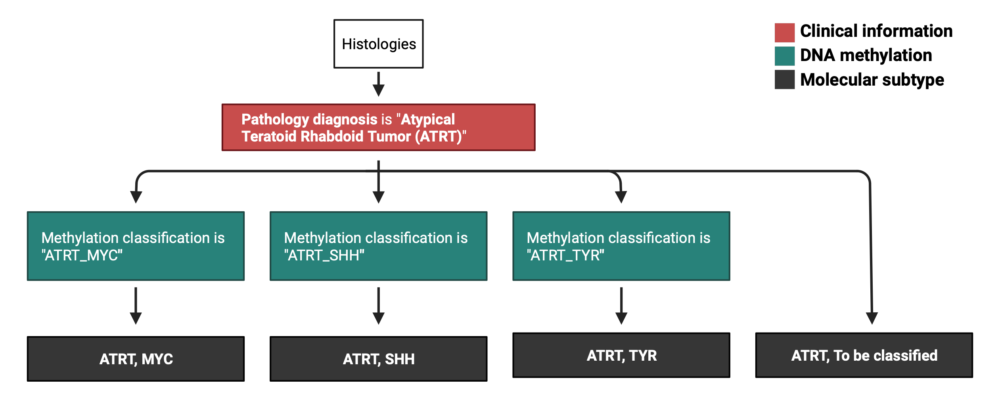

# Molecular Subtyping ATRT
Module authors: Zhuangzhuang Geng and Jo Lynne Rokita

*Note: the previous files/scripts can be find in Archive folder*

## Usage

To run all of the Rscripts in this module from the command line sequentially, use:

```
bash run-molecular-subtyping-ATRT.sh
```

`run-molecular-subtyping-ATRT.sh` is designed to be run as if it was called from this module directory even when called from outside of this directory.

## Molecular subtyping ATRT workflow

 


## Folder content

This folder contains scripts tasked to molecularly subtype ATRT samples in the PBTA dataset.
Methylation classification is used during subtyping.
The DKFZ v12b6 data are available in `dkfz_v12_methylation_subclass` and subtypes with `dkfz_v12_methylation_subclass_score >= 0.8` are considered high-confidence and used here.
The NIH Bethesda classifier v2 data are available in `NIH_v2_methylation_Class` and subtypes with `NIH_v2_methylation_Class_mean_score >= 0.9 and NIH_methylation_Superfamily_mean_score >= 0.9` are considered high-confidence and used here.

`00-ATRT_subtyping.R` selects samples from `histologies-base.tsv` and subtypes all PBTA and/or DGD tumor biospecimens into three subtypes, (`ATRT, MYC`, `ATRT, SHH` and `ATRT, TYR`).

* Filter the samples with `dkfz_v12_methylation_subclass_score >=0.8` and if `dkfz_v12_methylation_subclass` is one of the three ATRT subtypes ->
  * `ATRT, MYC`
  * `ATRT, SHH`
  * `ATRT, TYR`
If `dkfz_v12_methylation_subclass_score` < 0.8 but `NIH_v2_methylation_Class_mean_score >= 0.9 and NIH_methylation_Superfamily_mean_score >= 0.9`, and `NIH_v2_methylation_Class` is one of the three ATRT subtypes ->
  * `ATRT, MYC`
  * `ATRT, SHH`
  * `ATRT, TYR`
* All remaining samples -> `ATRT, To be clasified`

Final results is a table with `sample_id`, `Kids_First_Biospecimen_ID_meth`, `Kids_First_Biospecimen_ID_DNA`, `Kids_First_Biospecimen_ID_RNA`, and `molecular_subtype`, and saved as `ATRT-molecular-subtypes.tsv`