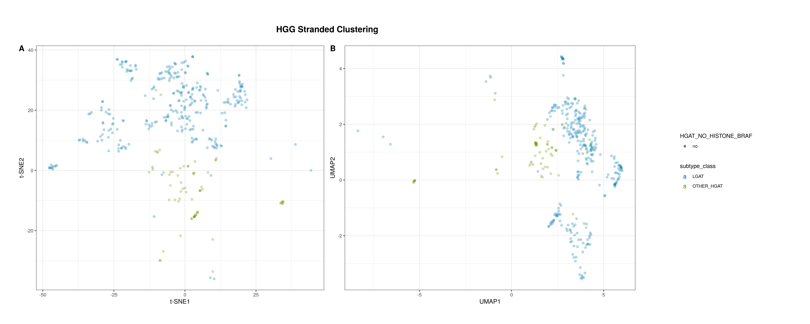

---
output:
  html_document: default
  pdf_document: default
---
# Molecular Subtyping High-grade Gliomas

**Module authors:** Chante Bethell ([@cbethell](https://github.com/cbethell)), Stephanie J. Spielman([@sjspielman](https://github.com/sjspielman)), and Jaclyn Taroni ([@jaclyn-taroni](https://github.com/jaclyn-taroni)), Jo Lynne Rokita([@jharenza](https://github.com/jharenza))

**Note: The files in the `hgg-subset` directory were generated via `02-HGG-molecular-subtyping-subset-files.R` using the the files in the version 14 data release.
When re-running this module, you may want to regenerate the HGG subset files using the most recent data release.**

## Molecular subtyping HGG workflow


## Usage

To run all of the Rscripts in this module from the command line sequentially, use:

```
bash run-molecular-subtyping-HGG.sh
```

When run in this manner, `02-HGG-molecular-subtyping-subset-files.R` will generate subset files using whichever files are symlinked in `data` on your local machine.

`run-molecular-subtyping-HGG.sh` is designed to be run as if it was called from this module directory even when called from outside of this directory.


## Folder content

This folder contains scripts tasked to molecularly subtype High-grade Glioma samples in the PBTA dataset.
[`00-HGG-select-pathology-dx.R`](https://github.com/d3b-center/OpenPedCan-analysis/blob/dev/analyses/molecular-subtyping-HGG/00-HGG-select-pathology-dx.R) gathers the exact matches for inclusion in the `pathology_diagnosis` and `pathology_free_text_diagnosis` which are saved in `hgg-subset/hgg_subtyping_path_dx_strings.json`, which is used downstream in `02-HGG-molecular-subtyping-subset-files` to generate subset files.


`01-HGG-molecular-subtyping-defining-lesions.Rmd` is a notebook written to look at the high-grade glioma defining lesions (_H3-3A_ K28M, _H3-3A_ G35R/V, _H3C2_ K28M, _H3C3_ K28M, _H3C14_ K28M/I) for all tumor samples except LGAT and EPN in the PBTA dataset. 
This notebook produces a results table found at `results/HGG_defining_lesions.tsv`.

`02-HGG-molecular-subtyping-subset-files.R` is a script written to subset the copy number, gene expression, fusion, mutation, SNV and GISTIC's broad values files to include only samples that meet one of the following criteria: 1) with defining lesions 2) have `pathology_diagnosis` values that match those in `hgg-subset/hgg_subtyping_path_dx_strings.json`.
This script produces the relevant subset files that can be found in the `hgg-subset` directory.

`03-HGG-molecular-subtyping-cnv.Rmd` is a notebook written to prepare the copy number data relevant to HGG molecular subtyping.
The CNVkit focal copy number file generated in the [`focal-cn-file-preparation`](https://github.com/d3b-center/OpenPedCan-analysis/blob/dev/analyses/focal-cn-file-preparation/) module is used as this CNVkit was also used to produce the GISTIC `broad_values_by_arm.txt` file that is also implemented in this module.
GISTIC arm values are coded as `"loss"` when arm values are negative, `"gain"` when arm values are positive, and `"neutral"` when arm value = 0. 
For samples that do not have GISTIC results, arm value = NA is given - this will apply to all WXS and panel data since now GISTIC is only run on WGS samples.
(Tumor ploidy is not taken into account.)
This notebook produces a CNV results table with cleaned CNVkit and GISTIC data found at `results/HGG_cleaned_cnv.tsv`.

`04-HGG-molecular-subtyping-mutation.Rmd` is a notebook written to prepare the consensus mutation data relevant to HGG molecular subtyping.
We filtered the subset SNV data to the genes of interest based on the following criteria: 

* For genes that were mentioned as defining or coocurring lesions (with the exception of _TERT_; see below), we included only mutations in coding sequences (CDS) that were not classified as silent mutations. 
Genes with a mutation that met these criteria are stored as comma-separated values in the `relevant_coding_mutations` column of the cleaned mutation table for a biospecimen.
* Any _TERT_ mutation was included. 
The `Variant_Classification` values for any _TERT_ mutation in a biospecimen are included in the `TERT_variant_classification` column of the cleaned table.
* The `IDH1_mutation` column of the cleaned table includes the contents of `HGVSp_Short` when it contains `R132` or `R172` or `No R132 or R172` when no _IDH1_ mutation that met that criterion was present.

The cleaned table is found at `results/HGG_cleaned_mutation.tsv`.

`05-HGG-molecular-subtyping-fusion.Rmd`is a notebook written to prepare the putative oncogenic fusion data relevant to HGG molecular subtyping.
Per [issue #249](https://github.com/AlexsLemonade/OpenPedCan-analysis/issues/249), we filtered the data to the two fusions of interest: _FGFR1_ fusions, which should be mutually exclusive of H3 K28 mutants, and _NTRK_ fusions, which are co-occurring with H3 G35 mutants.
**Note:** _NTRK_ refers to a [family of receptor kinases](https://www.biooncology.com/pathways/cancer-tumor-targets/ntrk/ntrk-oncogenesis.html), so we include the full fusion name to account for various individual _NTRK_ gene symbols.
Per [issue #474] (https://github.com/PediatricOpenTargets/ticket-tracker/issues/474), more gene fusions ( _ROS1_, _ALK_, and _MET_) were included as there is new 2021 entity within HGGs called "Infant-type hemispheric glioma" (IHG). This HGG is cerebral (hemispheric), arises in early childhood, and is characterized by RTK (receptor tyrosine kinase) alterations, typically fusions, in the _NTRK_ family, which has been included before, or in _ROS1_, _ALK_, or _MET_.
There is no mention of specific fusion partners or orientations, so we look at _any_ instances of fusions that include the genes mentioned above.
This notebook produces a fusion results table found at `results/HGG_cleaned_fusion.tsv`.

`06-HGG-molecular-subtyping-gene-expression.Rmd` is a notebook written to prepare the gene expression data relevant to HGG molecular subtyping.
Per [issue #249](https://github.com/AlexsLemonade/OpenPedCan-analysis/issues/249), we filtered the z-scored gene expression to genes of interest: _OLIG2_ and _FOXG1_ should be highly expressed in IDH mutants, and _TP73-AS1_ methylation and downregulation cooccurs with _TP53_ mutations.
This notebook produces two expression results table (one for each selection strategy) found at `results/HGG_cleaned_expression.tsv`.

`07-HGG-molecular-subtyping-combine-table.Rmd` is a notebook written to combine the cleaned copy number, mutation, fusion, and gene expression data (prepared in this module's previous notebooks) into one final table of results.
This notebook produces one table with the cleaned data found at `results/HGG_cleaned_all_table.tsv`.
Methylation classification is used during subtyping.
The DKFZ v12b6 data are available in `dkfz_v12_methylation_subclass` and subtypes with `dkfz_v12_methylation_subclass_score >= 0.8` are considered high-confidence and used here.
The NIH Bethesda classifier v2 data are available in `NIH_v2_methylation_Class` and subtypes with `NIH_v2_methylation_Class_mean_score >= 0.9 and NIH_v2_methylation_Superfamily_mean_score >= 0.9` are considered high-confidence and determined in order using DKFZ first and if a subtype score is < 0.8 for DKFZ but is high-confidence for NIH, then the NIH subtype is used.

A table with the molecular subtype information for each HGG sample at `results/HGG_molecular_subtype.tsv` is also produced, where the subtype values in the `molecular_subtype` column are determined as follows:

1. If there was an _H3-3A_ K28M or K28I, _H3C2_ K28M or K28I, _H3C3_ K28M or K28I, or _H3C14_ K28M or K28I mutation or high-confidence methylation subtype (`DMG_K27`, `DMG_EGFR`, or `GBM_THAL(K27)`)-> `DMG, H3K28`
2. If there was an _H3-3A_ G35V or G35R mutation or high-confidence methylation subtype (`DHG_G34` or `GBM_G34`) -> `HGG, H3 G35`
3. If there was an _IDH1_ R132 mutation or high-confidence methylation subtype (`A_IDH_HG` or `GBM_IDH`)-> `HGG, IDH`
4. In `histologies_base.tsv`, column `pathology_free_text_diagnosis` contains "infant type hemispheric glioma" or `dkfz_v12_methylation_subclass` == `IHG` -> `IHG`
    1. If there was a _NTRK_ fusion -> `IHG, NTRK-altered`
    2. If there was a _ROS1_ fusion -> `IHG, ROS1-altered`
    3. If there was a _ALK_ fusion -> `IHG, ALK-altered`
    4. If there was a _MET_ fusion -> `IHG, MET-altered`
    5. If there was no fusion -> `IHG, To be classified` based on IHG methylation classification and sample clinical report in the `pathology_diagnosis_free_text` stated as `infant type hemispheric glioma`
5. If methylation subtype == "PXA" or `pathology_free_text_diagnosis` contains "pleomorphic xanthoastrocytoma" or "pxa" AND there was a BRAF V600E mutation AND loss of CDKN2A and/or CDKN2B -> `HGG, PXA`
6. If methylation subtype == "O_IDH" -> `Oligo, IDH`
7. If methylation subtype == "OLIGO_IDH" -> `Oligosarcoma, IDH`
8. All other samples that did not meet any of these criteria were marked as `HGG, H3 wildtype` if there was no canonical histone variant the DNA sample, the methylation classification subtype if present, or else `HGG, To be classified` 

`08-1p19q-codeleted-oligodendrogliomas.Rmd` is a notebook written to identify samples in the OpenPBTA dataset that should be classified as 1p/19q co-deleted oligodendrogliomas.
The GISTIC `broad_values_by_arm.txt` file is used to identify samples with `1p` and `19q` loss, then the consensus mutation file is filtered to the identified samples in order to check for _IDH1_ mutations.
**Note:** Per [this comment](https://github.com/AlexsLemonade/OpenPBTA-analysis/pull/435#issuecomment-576898275), very few samples in the OpenPBTA dataset, if any, are expected to fit into the `1p/19q co-deleted oligodendrogliomas` subtype.
Also please **NOTE**: we currently only have GISTIC scores for WGS so we cannot tell whether a sample is `1p/19q co-deleted oligodendrogliomas` if they are sequenced with WXS or targeted sequencing.

`09-HGG-with-braf-clustering.Rmd` is a notebook written to identify high grade glioma samples without histone mutations that have `BRAF V600E` mutations and observe how they cluster alongside low grade gliomas and high grade gliomas without the `BRAF V600E` mutation in the stranded RNA-seq data (which contains both histologies) in RNA-seq data.
We plotted the t-SNE and UMAP results from the `transcriptomic-dimension-reduction`, highlighting samples without histone mutations and with a _BRAF_ V600E mutation. 
The results, shown below, suggest that one sample may be a candidate for reclassification (also saved in the `plots` directory of this module).



## Folder structure

The structure of this folder is as follows:

```
├── 00-HGG-select-pathology-dx.Rmd
├── 00-HGG-select-pathology-dx.nb.html
├── 01-HGG-molecular-subtyping-defining-lesions.Rmd
├── 01-HGG-molecular-subtyping-defining-lesions.nb.html
├── 02-HGG-molecular-subtyping-subset-files.R
├── 03-HGG-molecular-subtyping-cnv.Rmd
├── 03-HGG-molecular-subtyping-cnv.nb.html
├── 04-HGG-molecular-subtyping-mutation.Rmd
├── 04-HGG-molecular-subtyping-mutation.nb.html
├── 05-HGG-molecular-subtyping-fusion.Rmd
├── 05-HGG-molecular-subtyping-fusion.nb.html
├── 06-HGG-molecular-subtyping-gene-expression.Rmd
├── 06-HGG-molecular-subtyping-gene-expression.nb.html
├── 07-HGG-molecular-subtyping-combine-table.Rmd
├── 07-HGG-molecular-subtyping-combine-table.nb.html
├── 08-1p19q-codeleted-oligodendrogliomas.Rmd
├── 08-1p19q-codeleted-oligodendrogliomas.nb.html
├── 09-HGG-with-braf-clustering.Rmd
├── 09-HGG-with-braf-clustering.nb.html
├── README.md
├── hgg-subset
│   ├── hgg_focal_cn.tsv.gz
│   ├── hgg_fusion.tsv
│   ├── hgg_gistic_broad_values.tsv
│   ├── hgg_metadata.tsv
│   ├── hgg_snv_maf.tsv.gz
│   ├── hgg_subtyping_path_dx_strings.json
│   └── hgg_zscored_expression.RDS
├── plots
│   ├── HGG_stranded.pdf
│   ├── HGG_stranded.png
│   └── mol_subtype_workflow.png
├── results
│   ├── HGG_cleaned_all_table.tsv
│   ├── HGG_cleaned_cnv.tsv
│   ├── HGG_cleaned_expression.tsv
│   ├── HGG_cleaned_fusion.tsv
│   ├── HGG_cleaned_mutation.tsv
│   ├── HGG_defining_lesions.tsv
│   └── HGG_molecular_subtype.tsv
└── run-molecular-subtyping-HGG.sh
```
