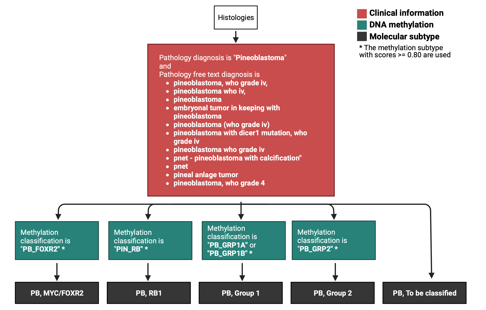

# Molecular Subtyping Pineoblastoma (PB)
Module authors: Zhuangzhuang Geng

## Usage

To run all of the Rscripts in this module from the command line sequentially, use:

```
bash run-molecular-subtyping-PB.sh
```

`run-molecular-subtyping-PB.sh` is designed to be run as if it was called from this module directory even when called from outside of this directory.

## Workflow of PB molecular subtyping




## Folder content

This folder contains scripts tasked to molecularly subtype PB samples 

* Filter the samples with `dkfz_v12_methylation_subclass >=0.8` and `cns_methylation_subclass` is one of the three PB subtypes ->
  * PB_FOXR2: pineoblastoma, MYC/FOXR2-activated (PB, MYC/FOXR2)
  * PB_GRP1A, PB_GRP1B: pineoblastoma, miRNA processing-altered 1 (PB, Group 1)
  * PB_GRP2: pineoblastoma, miRNA processing-altered 2 (PB, Group 2)
  * PIN_RB: pineoblastoma, RB1-altered (PB, RB1)

* If methylation does not exist or `dkfz_v12_methylation_subclass < 0.8`  for any PB samples -> `PB, To be clasified`

Final results is a table with `Kids_First_Biospecimen_ID`, `Kids_First_Participant_ID`, `sample_id`, `molecular_subtype_methyl`, and `molecular_subtype`, and saved as `pb-molecular-subtype.tsv`