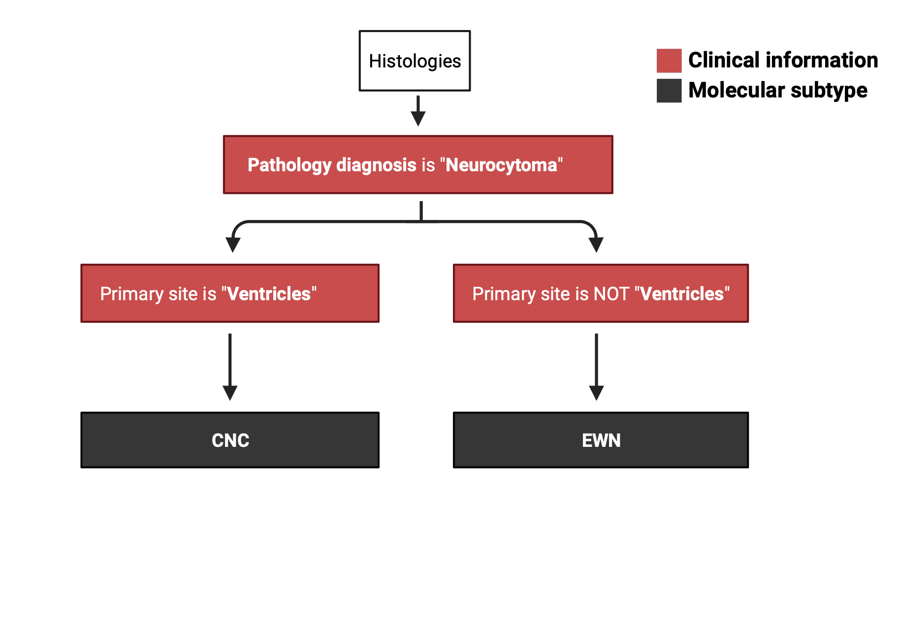

# Molecular Subtyping of Neurocytoma

**Module authors:** Krutika Gaonkar ([@kgaonkar6](https://github.com/kgaonkar6i)), Jo Lynne Rokita ([@jharenza](https://github.com/jharenza))

In this analysis we subtype Neurocytoma samples according to the primary_site and pathology_diagnosis values. If primary_site == "Ventricles" then subtype is CNC (central neurocytoma) if primary_site != "Ventricles" then subtype is EVN (extraventricular neurocytoma)

## Molecular subtyping neurocytoma workflow

 


### Inclusion/exclusion criteria

Samples are _included_ for subtyping if we detect the following strings in the `pathology_diagnosis` field of `histologies-base.tsv`:

```
Neurocytoma
```

`01-neurocytoma-subtyping.Rmd` reads in the histology file and adds molecular_subtype for neurocytoma samples as `CNC` if primary_site == "Ventricles" and `EVN` if primary_site != "Ventricles"  

### Run script

```sh
bash run_subtyping.sh
```
